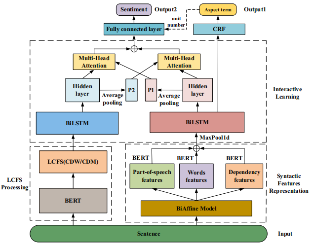

# A syntactic features and interactive learning model for aspect-based sentiment analysis

A syntactic features and interactive learning model for aspect-based sentiment analysis accepted by Complex & Intelligent Systems (2024)

# AESC
The aspect sentiment classification (AESC) task includes aspect terms extraction (AE)  and aspect terms sentiment analysis (ASC).

Need to download datasets: Laptop14, Restaurant14.
additional public datasets: amazon, yelp.

Download Stanford Syntax Parser

The Dataset and the Stanford Parser package are too big for me to upload, so go to the official website and download them yourself.
